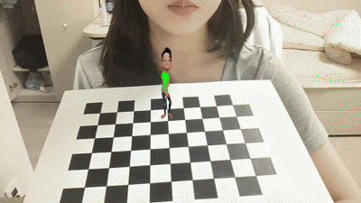

## 1. Project Overview

이 프로젝트는 사전 캘리브레이션된 카메라 파라미터를 활용하여 실시간으로 카메라의 위치와 방향을 추적하는 **Camera Pose Estimation(카메라 자세 추정)**과, 이를 바탕으로 3D 공간 상에 가상의 객체를 투영하고 기록하는 **AR Video Recording(증강현실 녹화)** 과정으로 구성됩니다. 특히 유행하는 춤을 추는 소년의 애니메이션(GIF)을 체스판 위에 투명도 손실 없이 합성하고, 이를 고화질 비디오(`.mp4`)로 추출하는 기술적 과정을 분석합니다.

## 2. Camera Calibration Results (카메라 캘리브레이션 결과)

HW3 과정에서 추출한 카메라의 고유 파라미터를 기반으로 정밀한 AR 투영을 수행합니다.

### Intrinsic Parameters (카메라 내부 파라미터 / Camera Matrix)

- **fx (Focal length x):** 984.91
- **fy (Focal length y):** 982.06
- **cx (Principal point x):** 634.68
- **cy (Principal point y):** 348.33

### Distortion Coefficients (왜곡 계수 / dist)

- **Coefficients:** [0.06679, -0.06335, -0.00682, 0.00312, -0.34412]

### Reprojection Error (재투영 오차)

- **RMSE (Root Mean Square Error):** 0.8517
  > **Analysis (분석):** 1.0 미만의 에러율을 통해 왜곡 보정 및 자세 추정에 최적화된 신뢰도 높은 데이터를 확보함

---

## 3. AR Visualization & Recording Demo (AR 시각화 및 녹화 데모)

### 🎥 Live AR Tracking Video (실시간 증강현실 추적 및 녹화)

> 체스판의 동적 움직임에 따라 실시간으로 변화하는 '춤추는 소년' 애니메이션이 원근감 있게 합성된 결과 확인

#### Version A: Dancing Boy AR Recording (최종 녹화 결과)

---

## 4. Technical Analysis (기술적 분석: 투명도 합성 및 녹화)

단순한 전광판 형태가 아닌, 배경이 제거된 누끼 상태의 캐릭터를 자연스럽게 합성하기 위한 기술적 고도화를 진행했습니다.

#### 1) Alpha Blending & Transparency (투명도 합성 분석)

- **Problem (문제):** 일반적인 비디오 리더(OpenCV)는 GIF의 투명 채널을 인식하지 못하고 흰색 배경으로 출력하는 현상 발생
- **Solution (해결):** `Pillow` 라이브러리를 통해 GIF의 RGBA(4채널) 데이터를 직접 추출하고, **Alpha Blending** 수식을 적용하여 배경 노이즈 없는 정밀한 캐릭터 합성 구현

#### 2) Perspective Transform & Recording (원근 변환 및 인코딩)

- **Characteristic (특징):** `cv.projectPoints`로 투영된 4개의 가상 3D 좌표를 기반으로 실시간 워핑(Warping)을 수행하며, `cv.VideoWriter`를 통해 `mp4v` 코덱으로 인코딩함
- **Analysis (분석):** 연산량이 많은 자세 추정 프로세스 속에서도 초당 20프레임(FPS)의 안정적인 녹화 속도를 유지하여 실제 세계와 가상 객체의 동기화 일관성을 확보함

---

## 5. How to Run (실행 방법)

1. `calibration_data.npz`와 `dancing_boy.gif` 파일을 소스 코드와 동일한 경로에 위치시킴
2. **`dancing_boy_ar.py`를 실행**하여 실시간 웹캠 뷰어 활성화
3. 체스판 위에 춤추는 소년이 등장하는 것을 확인한 후 `ESC`를 눌러 종료
4. 생성된 **`dancing_boy_result.mp4` 파일**을 통해 최종 결과 확인
